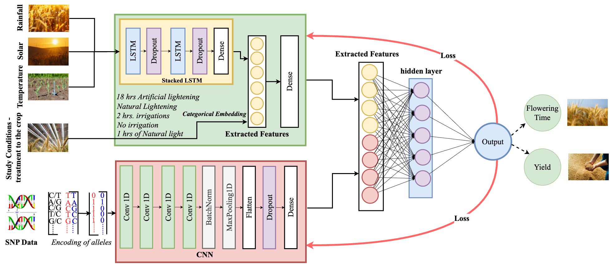
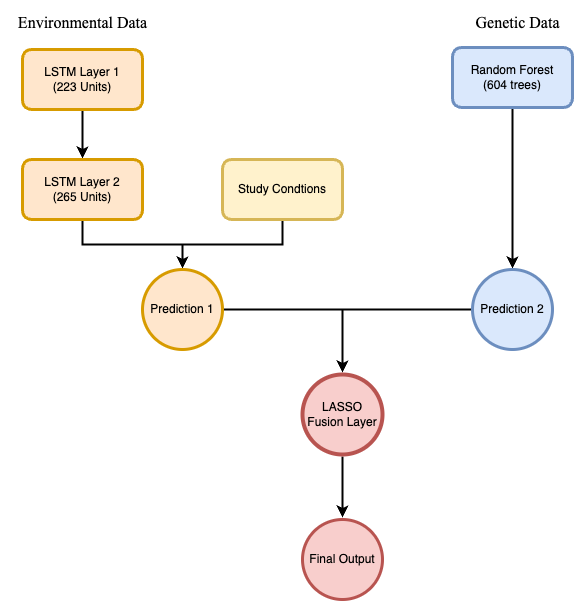

# Multimodal Deep Learning for the Prediction of Crop Phenotype using Heterogeneous Data
**Master Thesis Project | IEEE CAI 2025 Publication**

## Project Description
This master thesis presents a novel multimodal deep learning approach for crop phenotype prediction by integrating multiple data modalities through an intermediate fusion architecture. The project focuses on predicting barley's flowering time and yield using genetic markers, environmental data, and study conditions.

## Research Objectives
- Integration of different data modalities (genetic, environmental, study conditions) to enhance prediction accuracy
- Development of fusion strategies combining CNN and LSTM networks 
- Processing of high-dimensional genetic data (30,543 markers) with environmental time series
- Evaluation against traditional single-modality approaches
- Advancement of precision agriculture through improved phenotype prediction

## Model Architecture

### CNN-LSTM Intermediate Fusion Model


The intermediate fusion model combines environmental, genetic, and study data early in the network:
- 4-layer CNN for genetic marker feature extraction (30,543 features)
- 2-stack LSTM for environmental data processing
- Embedding layer for categorical study conditions

### LSTM-RF Late Fusion Model (Baseline)


Uses Random Forest for genetic data processing due to its demonstrated superior performance with high-dimensional genetic markers.

## Dataset Overview

### Genetic Data
- Source: Western Barley Genetic Alliance (WCGA), Murdoch University
- 894 barley accessions (Next-Generation Sequencing)
- 30,543 SNP markers (quality filtered):
  - Heterozygosity filtering
  - Mapping quality threshold: 20
  - Major allele frequency (MAF): 0.01
  - Average marker density: ~150kb

### Environmental Data
- Source: Australian Bureau of Meteorology (BOM)
- Variables:
  - Rainfall
  - Temperature
  - Solar radiation
- Period: March to July (5 months)
- Locations: Geraldton, Merredin, South Perth, Katanning, Esperance
Environmental data corresponds to the specific geographic locations where field trials were conducted, enabling direct correlation between weather conditions and crop performance.

### Field Trials
- 12 experiments (2015-2016)
- Special Trials:
  - Light Exposure (South Perth, 2016):
    - 18-hour artificial vs. natural lighting
  - Irrigation (Merredin):
    - Irrigated vs. non-irrigated conditions
Each trial site represents distinct climatic zones, providing diverse environmental conditions for phenotype assessment.

## Publications

This research has been published in the following prestigious conference:

* **A Multimodal Deep Learning End-to-End Model for Improving Barley Genotype-to-Phenotype Prediction Using Heterogeneous Data**
    * **Conference:** 2025 IEEE Conference on Artificial Intelligence (CAI)
    * **DOI/Link:** [https://ieeexplore.ieee.org/document/11050631](https://ieeexplore.ieee.org/document/11050631)

Use the following BibTeX format to cite this paper:

```bibtex
@INPROCEEDINGS{11050631,
  author={Pradhan, Samuel and Wang, Guanjin and Xuan, Junyu and Wang, Penghao and Li, Chengdao and Lu, Jie},
  booktitle={2025 IEEE Conference on Artificial Intelligence (CAI)}, 
  title={A Multimodal Deep Learning End-to-End Model for Improving Barley Genotype-to-Phenotype Prediction Using Heterogeneous Data}, 
  year={2025},
  volume={},
  number={},
  pages={322-327},
  keywords={Deep learning;Precision agriculture;Phenotypes;Crops;Genomics;Predictive models;Flowering plants;Data models;Bioinformatics;Long short term memory;crop phenotype prediction;deep learning;fusion model;multimodal learning},
  doi={10.1109/CAI64502.2025.00059}}

```
